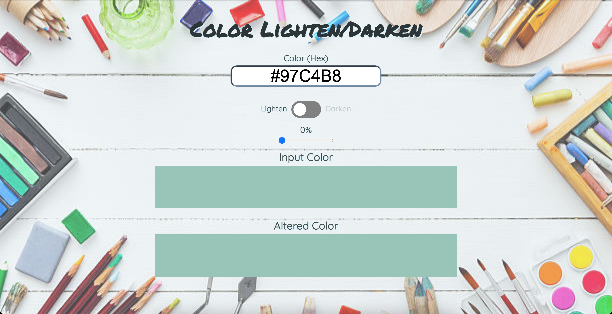

# Color Lighten/Darken Tool
- A Color Lighten/Darken tool built with vanilla HTML, CSS, and JavaScript

  

- This is the companion project of the course [Build a color tool in vanilla JavaScript](https://scrimba.com/learn/javascriptcolortool) by James Q Quick
- What have been covered
  - HTML, CSS, and JavaScript
  - DOM manipulation
  - Hex and RGB colors
  - Creating a custom toggle button